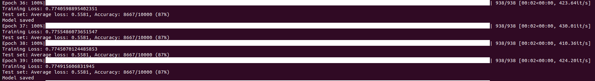

# PyTorch MNIST Training Example

This repository contains a PyTorch implementation of a Convolutional Neural Network (CNN) for training and testing on the MNIST dataset. The model is trained using Adadelta optimizer and includes support for CUDA and macOS GPU acceleration.

## Table of Contents
- [Installation](#installation)
- [Usage](#usage)
  - [Training](#training)
  - [Testing](#testing)
- [Model Architecture](#model-architecture)
- [Arguments](#arguments)
- [Results](#results)

## Installation

1. Clone the repository:
    ```sh
    git clone https://github.com/agustyawan-arif/mnist-object-classification.git
    cd mnist-object-classification
    ```

2. Install the required packages:
    ```sh
    pip install argparse torch tqdm torchvision
    ```

## Usage

### Training

To train the model, run the following command:

```sh
python script.py --epochs 20 --batch-size 64 --lr 0.0001
```

### Testing

Testing is automatically performed after each epoch during training. The best model (with the lowest test loss) will be saved as `model.pt`.

## Model Architecture

The model architecture is defined in the `Net` class and consists of:

- Two convolutional layers (`conv1`, `conv2`)
- Two dropout layers (`dropout1`, `dropout2`)
- Two fully connected layers (`fc1`, `fc2`)
- ReLU activations and log softmax output

## Arguments

The script accepts the following command-line arguments:

- `--batch-size`: Input batch size for training (default: 64)
- `--test-batch-size`: Input batch size for testing (default: 1000)
- `--epochs`: Number of epochs to train (default: 20)
- `--lr`: Learning rate (default: 0.0001)
- `--gamma`: Learning rate step gamma (default: 0.7)
- `--no-cuda`: Disables CUDA training
- `--no-mps`: Disables macOS GPU training
- `--seed`: Random seed (default: 1)

## Results

The training and testing process will output the average loss and accuracy after each epoch. The model with the best test loss will be saved as `model.pt`.


```
Epoch 1: Training Loss: 0.774915
Test set: Average loss: 05581, Accuracy: 8667/10000 (87%)
Model saved
```


